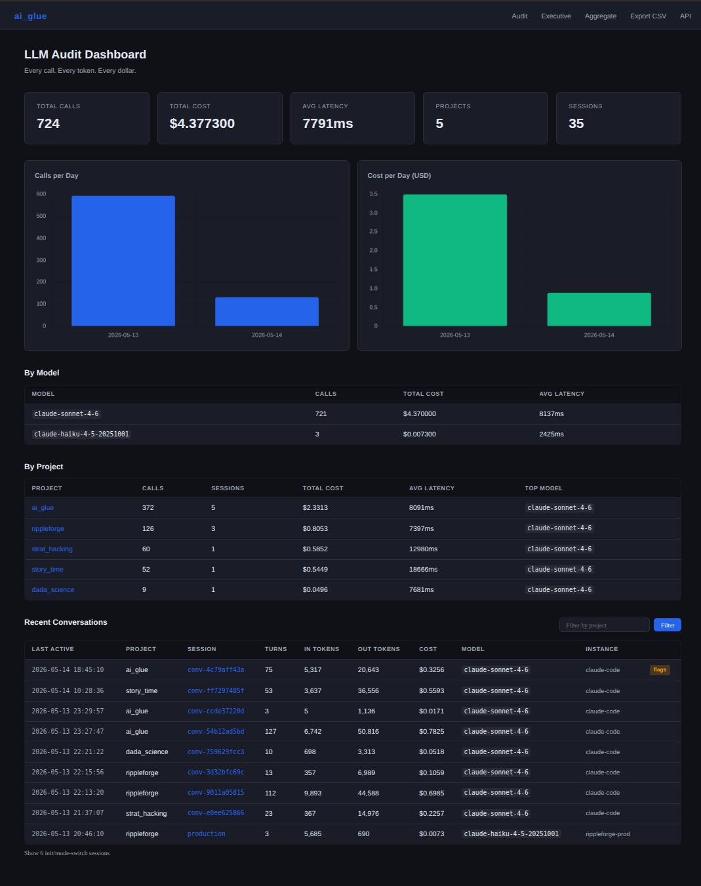
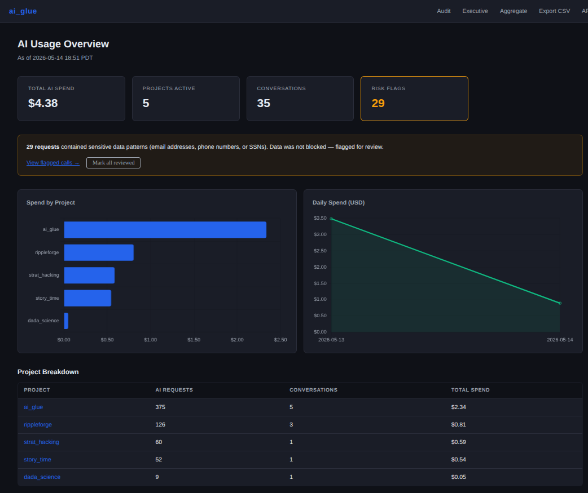
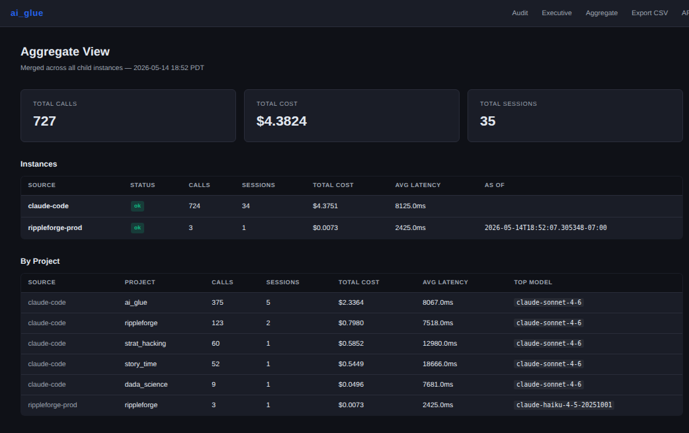

# ai_glue

Drop-in AI observability and governance for OpenAI and Anthropic applications.



## What ai_glue gives you

- Every AI call logged — provider, model, tokens, cost, latency, project, session
- Spend visibility by project, team, and environment
- PII detection with per-call flag review workflow
- Hard governance rules — block unapproved models, enforce cost caps and rate limits
- Multi-instance aggregation — dev, staging, and prod in one unified dashboard
- Role-split views: engineering audit log, executive spend summary, per-instance breakdown
- Add governance to existing apps with **one environment variable change** — no code rewrites

## What ai_glue is not

ai_glue does not replace your AI stack. It has no opinion on prompts, agents, RAG pipelines, or orchestration. It sits between your applications and model providers to add governance, auditing, spend visibility, and policy enforcement. Think of it as a transparent proxy with a dashboard — not a framework.

## Deployment models

**Evaluating / self-hosted** — you are both the operator and the user. Clone it, add your own API key to `.env`, run it on your machine. The quickstart below covers this case.

**Team deployment** — IT deploys one ai_glue instance on a shared server with the organization's API key in `.env`. Individual developers never touch an API key. They change one environment variable on their machine and everything is logged, governed, and visible on the shared dashboard.

```
                       ┌─────────────────────────────────────┐
dev laptop             │  ai_glue server                      │
ANTHROPIC_BASE_URL ───►│  .env: ANTHROPIC_API_KEY=sk-org-...  │──► Anthropic API
                       │  dashboard: http://ai-glue.internal  │
                       └─────────────────────────────────────┘
```

## Quickstart (local / evaluation)

```bash
git clone https://github.com/simonhansedasi/ai_glue.git
cd ai_glue
pip install -r requirements.txt
cp .env.example .env              # add your API keys
cp governance.yaml.example governance.yaml
python examples/governance_demo.py   # no API keys needed
python app.py                     # http://localhost:5010
```

## Two integration modes

### Mode 1 — Proxy (zero code changes)

Point existing apps at ai_glue instead of the real provider. One environment variable per app:

```bash
# Anthropic
ANTHROPIC_BASE_URL=http://your-host:5010/proxy/anthropic

# OpenAI
OPENAI_BASE_URL=http://your-host:5010/proxy/openai/v1
```

Every call is intercepted, logged, and governance-checked. The app receives the real response unchanged. Streaming is fully supported — the proxy passes the stream through and captures token counts and latency at the end.

Tag calls with optional headers for project and session labeling:
```
X-Aiglue-Project: hr-bot
X-Aiglue-Session: user-123
```

If no headers are present, calls fall back to `AIGLUE_DEFAULT_PROJECT` / `AIGLUE_DEFAULT_SESSION` from `.env`.

### Mode 2 — Wrapper (new apps or when you control the code)

```python
from src import GluedClient

# Anthropic — same API as anthropic.Anthropic()
client = GluedClient("anthropic", session_id="user-123", project="hr-bot")
response = client.messages.create(
    model="claude-sonnet-4-6",
    max_tokens=512,
    messages=[{"role": "user", "content": "..."}],
)

# OpenAI — same API as openai.OpenAI()
client = GluedClient("openai", session_id="user-123", project="support-bot")
response = client.chat.completions.create(
    model="gpt-4o",
    max_tokens=512,
    messages=[{"role": "user", "content": "..."}],
)
```

## Governance

Edit `governance.yaml` to configure rules. Changes apply immediately — no restart needed.

```yaml
model_allowlist:          # hard-block calls to unapproved models (403)
  - claude-sonnet-4-6
  - gpt-4o

pii_detection: true       # flag prompts containing emails, SSNs, phones, credit cards

pii_allowlist:            # exact strings that should never trigger a PII flag
  - admin@yourcompany.com

projects:
  hr-bot:
    daily_cost_cap_usd: 5.00     # hard-block once daily spend hits cap
    rate_limit_per_hour: 100     # hard-block sessions that exceed call frequency
```

PII detection is regex-based (not ML). Hard-blocking violations are never logged — the call was never made. PII flags are logged as warnings and do not block calls.

**Security note**: `governance.yaml` becomes a sensitive file if you use the team API key mapping feature (see below), since it maps key prefixes to real project names. Treat it like `.env` in production — restrict filesystem permissions and do not commit it. `governance.yaml` is gitignored by default for this reason.

## Dashboard

All three views draw from the same unified dataset merged across all instances.

### `/` — Audit (engineers / team leads)

Full call log. Every call from every instance in one table. Summary cards, daily charts, and by-project/by-model breakdowns are all merged across instances. Per-session drilldown shows individual turns, tool calls, and highlights flagged PII inline. Filters: `?project=X`, `?session=X`, `?flagged=1`.

### `/executive` — Executive view (leadership)

Non-technical. No session IDs, no model names. Cards: Total AI Spend, Projects Active, Conversations, Risk Flags. Charts: Spend by Project, Daily Spend trend. Unreviewed PII flags and governance blocks surface as a risk callout with a "Mark all reviewed" action.



### `/aggregate` — Per-instance breakdown

One panel per instance with its individual summary, by-project table, and by-model table. Useful for comparing dev vs. staging vs. prod activity side by side.



## Multi-instance aggregation

Run one ai_glue instance per environment. A parent instance pulls `/api/summary` from each child and merges everything into a single unified view.

```
Dev instance    ──┐
Staging instance ─┼──► Parent instance ──► unified /, /executive, /aggregate
Prod instance   ──┘
```

To add a child — edit `governance.yaml` on the parent only, no code changes:

```yaml
aggregator:
  children:
    - name: prod
      url: http://prod-host:5010
    - name: staging
      url: http://staging-host:5010
```

Set `AIGLUE_INSTANCE_NAME` on each child so it appears with a meaningful label in parent views.

## Per-team API key mapping

Issue each team a synthetic key with a recognizable prefix. Teams swap their real provider key for it — no other changes needed. The proxy detects the prefix, tags all calls with the team's project name, and substitutes the real API key before forwarding. This enables centralized billing, per-team spend attribution, and chargeback models without distributing raw provider keys.

```yaml
teams:
  sk-aiglue-eng:
    name: engineering
  sk-aiglue-marketing:
    name: marketing
```

Add spend caps or rate limits per team by adding the team name to `projects:` in `governance.yaml`.

## What gets logged

| Field | Description |
|---|---|
| ts | UTC timestamp |
| provider | anthropic / openai |
| model | exact model string |
| session_id | caller-supplied, auto-detected, or default |
| project | caller-supplied, auto-detected, or default |
| input_tokens | from API response |
| output_tokens | from API response |
| cost_usd | estimated from token counts |
| latency_ms | wall time |
| prompt_hash | MD5 of prompt |
| raw_prompt | full text (if AIGLUE_LOG_RAW=true) |
| raw_response | full text (if AIGLUE_LOG_RAW=true) |
| gov_flags | JSON array of warning strings |
| error | exception message if call failed |
| reviewed_at | timestamp when flags were acknowledged |

Set `AIGLUE_LOG_RAW=false` in `.env` to store only the hash when prompt content is sensitive. Restrict filesystem permissions on `audit.db` in production — it contains call metadata and optionally raw prompts.

## Tests

```bash
pytest tests/ -v 
```

23 tests. No API keys required. All LLM calls are mocked.

## Stack

- Python 3.7+, Flask, SQLite
- Chart.js (CDN, no build step)
- Anthropic SDK, OpenAI SDK

## Environment variables

| Variable | Default | Description |
|---|---|---|
| ANTHROPIC_API_KEY | — | API key used by the server to forward calls. In team deployments, only the server's `.env` needs this — individual developers do not. |
| OPENAI_API_KEY | — | Same as above for OpenAI. |
| AIGLUE_DB | audit.db | Path to SQLite audit database |
| AIGLUE_LOG_RAW | true | Store full prompt/response text |
| AIGLUE_DEFAULT_PROJECT | proxy | Project label for untagged proxy calls |
| AIGLUE_DEFAULT_SESSION | proxy | Session label for untagged proxy calls |
| AIGLUE_INSTANCE_NAME | (AIGLUE_DEFAULT_PROJECT) | Label shown in parent aggregator views |

## License

MIT
